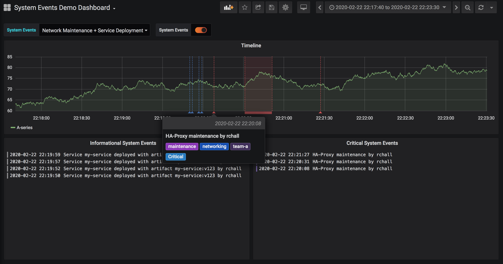
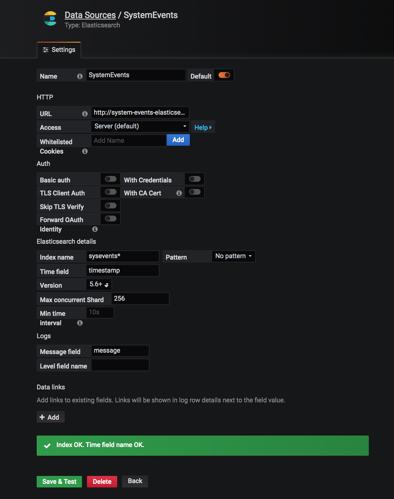
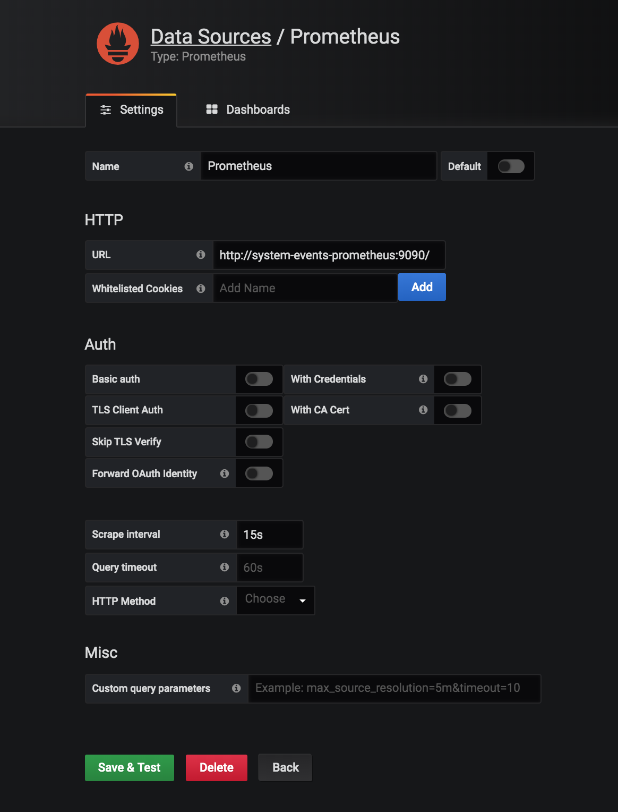

# Annotation Events

The System Events service is an http service that can proxy formatted annotation events to an Elastic Search Deployment.

Elasticsearch is a search engine based on the Lucene library that is very popular for event log data. You can 
use it from Grafana to create annotations based on the events you proxy to it using the System Events Service.
Read about how to use [Grafana annotations with Elasticsearch](https://grafana.com/docs/grafana/latest/features/datasources/elasticsearch/#annotations)

## When to use 

Annotation events are very useful when maintaining a system owned by multiple developers, specially multiple teams. It improves the troubleshooting process by providing accurate information on the different things that ocurred before an outage that could be the potential root causes of it.

## Usage

- Simple System Events

Use `POST /event ` to create a new system event at the time of the request 

- Range System Events

Use `POST /event/start` to indicate a system event just started. Use the returned `eventId` with the `POST /event/end` to indicate the system event finished. This feature is very useful for prolonged events like maintances and deployements of large farms.



# Versionning

Because the System Events service uses internally the NEST Client it's version matches the version of the NEST Client, to make it easier to pick the correct version that would work with your Elastic Search Deployment version. Read about [NEST Client versioning](https://github.com/elastic/elasticsearch-net#compatibility-matrix)

# How to run

## Local development using [Docker Compose](https://docs.docker.com/compose/)

Build the event system service and all the supporting services for local development
```
docker-compose build
```

Deploy Elastic Search locally
```
docker-compose up -d elasticsearch
```

Create the `system event` index on your previously deployed ES
```
docker-compose up -d es-index-creator
```

Finally deploy the `System Events` service
```
docker-compose up -d system-events
```

## Using Docker

```
docker run --env-file path/to/envvars --volume path/to/config.yml:/config/config.yml --name system-events raulchall/system-events
```

## Sending Events

Find which port the `System Events` service is running
```
docker port system-events
```

### Using curl

Find examples on the [scripts](scripts/) folder

```
sh scripts/send-event.sh {system-events-port} 
```
Replace the `system-events-port` with the port obtained on the previous step

### Using Swagger UI

Visit http://localhost:{system-events-port}/swagger

## Visualizing Events on Grafana

Deploy Grafana locally
```
docker-compose up -d grafana
docker port system-events-grafana
```
Visit http://localhost:{grafana-port}/swagger 

### Setting up your ES System Events Datasource

Add a new Grafana Datasource. Set 
Name = `SystemEvents`
Url  = `http://system-events-elasticsearch:9200/`

Follow the image for the rest of the fields



### Import example dashboard

On Grafana import the [example dashboard](dashboards/system-events-demo.json)
Done!

# Monitoring

The System Events service exposes [Prometheus metrics](https://prometheus.io/docs/).
You can deploy the Prometheus stack locally to checkout the metrics.

Run Prometheus server
```
docker-compose up -d prometheus
```

Go back to Grafana and setup the Prometheus Datasource. Set 
Name = `Prometheus`
Url  = `http://system-events-prometheus:9090/`

Follow the image for the rest of the fields



Import the [System Events Internal Metrics Dashboard](dashboards/system-event-internals.json) to Grafana 
Done

# Configuration

The System Events service requires a basic configuration and adds extra configuration if advance features are required

## Basic Configuration

Provide values for following environment variables. 

```
Serilog:MinimumLevel=Error

# IMPORTANT: If running in Production remove these 2 variables
ASPNETCORE_ENVIRONMENT=Development
ASPNETCORE_SUPPRESSSTATUSMESSAGES=true

# Variables for the ES Client

# Specify the Uris for the nodes on your ES cluster separated by comma
ELASTICSEARCH_URL_CSV=http://system-events-elasticsearch:9200/
ELASTICSEARCH_INDEX=sysevents
ELASTICSEARCH_TIMEOUT_MS=5000

# This format needs to match the format for your date fields in your ES Index
ELASTICSEARCH_DATETIME_FORMAT=yyyy-MM-dd'T'HH:mm:ssZ
```

## Advanced Configuration

Add an extra environment variable containing the path to the 
Advance configuration file

```
AdvanceConfigurationPath=../config/config.yml
```

### Adding support for Category restrictions

Example of Advance Configuration file

config.yml
```
categories:
  - name: Adhoc
    description: Use it for unplanned events
  - name: Database Migration
    description: Database migration events
  - name: Service Deployment
    description: Service deployment events
  - name: Network Maintenance
    description: Network Maintenance events
    level: critical
```

By adding specific Event Categories the service will reject System Events with not allowed Categories, this way the number of categories can be kept under control. Optionally specify a level for the category, if a level is specified then the system will reject events for the category on different levels, otherwise all levels will be allowed for the category.

You can always relax this restriction by adding `*` as an allowed category

config.yml
```
categories:
  - name: '*'
    description: All categories are allowed
  - name: Database Migration
    description: Database migration events
    level: critical
```

In this case the restriction for only `critical`  `Database Migration` events will still apply but the system will allow any other incoming category.

### Adding support for Category Subscriptions

This feature allows for creating notification channels for specific Event Categories, allowing broadcast notifications of important or relevant system events.

It requires the category to be defined under the `categories` section.

Example of Advance Configuration file

config.yml
```
categories:
  - name: Adhoc
    description: Use it for unplanned events
  - name: Database Migration
    description: Database migration events
  - name: Service Deployment
    description: Service deployment events
  - name: Network Maintenance
    description: Network Maintenance events

subscriptions:
  - type: sns
    category: Network Maintenance
    topic_arn: arn:aws:sns:us-east-1:000000000000:system-event-network-maintenance
  - type: sns
    category: Database Migration
    topic_arn: arn:aws:sns:us-east-1:000000000000:system-event-database-migration
  - type: slack
    category: Service Deployment
    webhook_url: https://hooks.slack.com/services/Your/WebHook/Url
```

You can create a subscription for all your categories by using the `*` category
Ex.
```
subscriptions:
  - type: slack
    category: '*'
    webhook_url: https://hooks.slack.com/services/Your/WebHook/Url
```

Supported Notification Channels:
- [Slack Webhooks](https://api.slack.com/messaging/webhooks)
- [AWS Simple Notification Service (Sns)](https://aws.amazon.com/sns/?whats-new-cards.sort-by=item.additionalFields.postDateTime&whats-new-cards.sort-order=desc)

# Creating events from slack

You can optionally deploy the [Slack App Backend](slack-app-backend/README.md) to make it easier for developers to report events. By default all `categories` on the Advance Configuration are not eligible to be created from the slack app, use the `slack_app` flag to enable it.

On your config.yml

```
categories:
  - name: '*'
    description: Allow all events
  - name: Adhoc
    description: Adhoc events
    slack_app: true  # Allow users to create Adhoc category from Slack App
```

# Running in Production

Checklist

- Make sure your `ASPNETCORE_ENVIRONMENT` is set to other than `Development`. Or not present in your environment
- Set your Log Level to Error `Serilog:MinimumLevel=Error`. Too much logging impacts performance
- Either build from source or use the image from [Docker Hub](https://hub.docker.com/repository/docker/raulchall/system-events)
- Have fun!

# Contributing

Same, same. Add [issues or feature requests](https://github.com/raulchall/annotation-events/issues). Send me a PR. 
